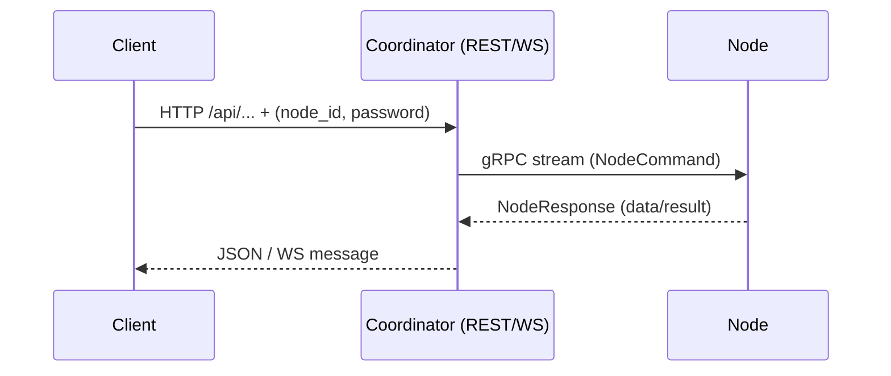

# Docklord

**Docklord** is a lightweight, high-performance Docker container management and monitoring tool written in Rust. It acts as a **proxy-like orchestration bridge** between clients and Docker hosts.

- **Clients** send requests to the **Coordinator** via REST API or WebSocket.
- **Coordinator** converts those requests into gRPC commands and sends them to the appropriate **Node** over a persistent, outbound gRPC stream (port `50051`).
- **Node** executes the requested Docker actions (start/stop/list/show containers, fetch logs, etc.) using `/var/run/docker.sock`.
- Results are sent back from the Node to the Coordinator via gRPC and returned to the client via REST/WS.

No inbound ports are required on Nodes — ideal for secure, remote container management.



---

## Architecture Overview

- **Node** — lightweight agent running on your server/PC/VPS; connects out to the Coordinator; interacts directly with Docker.
- **Coordinator** — central service (public or self-hosted) that exposes REST and WebSocket APIs for clients, handles authentication, and dispatches gRPC commands to Nodes.
- **Clients** — any app, CLI, or integration that talks to the Coordinator’s REST/WS endpoints using `node_id` and `password`.

---

## Quick Start

> **Local testing tip:** If you plan to run **Coordinator** and **Node** on the same device for testing, prefer the **self-hosted (all-in-one)** mode. Running both components separately on the same host (for example starting `docklord-coordinator` and `docklord-node` individually) may introduce port or network alias conflicts and complicate configuration. Use `self-hosted` for a simple local test environment, and run `coordinator` and `node` separately only when deploying to different hosts.

### Option A — Pre-built Binary

1. Download the latest release from GitHub.
2. Make it executable:

```bash
chmod +x docklord
```

3. Examples:

```bash
# All-in-one (Coordinator + Node)
./docklord --type self-hosted

# Node only (connect to remote Coordinator)
./docklord --type node --coordinator-addr http://82.27.2.230:50051
```

4. Test API:

If your Node is connected to your **own local/self-hosted Coordinator**:

```bash
curl -s "http://localhost:3000/api/containers?node_id=YOUR_NODE_ID&password=YOUR_PASSWORD" | jq '.'
```

If your Node is connected to **my public server** (`82.27.2.230`):

```bash
curl -s "http://82.27.2.230:3000/api/containers?node_id=YOUR_NODE_ID&password=YOUR_PASSWORD" | jq '.'
```

### Option B — Docker (Production Recommended)

#### Connect to Public Coordinator

```bash
COORDINATOR_ADDR=http://82.27.2.230:50051 \
  docker-compose up docklord-node
```

#### Self-hosted (All-in-one)

```bash
git clone https://github.com/DaDaDaTheoryNow/docklord.git
cd docklord
docker-compose up docklord-self-hosted
```

#### Coordinator + Node Separately (for distributed deployment)

```bash
# Coordinator (central service)
docker-compose up docklord-coordinator

# Node (COORDINATOR_HOST - remote host address)
COORDINATOR_ADDR=http://{COORDINATOR_HOST}:50051 docker-compose up docklord-node
```

---

## REST API Commands

All REST requests must include `node_id` and `password` as query parameters for authentication.

### 1. List all containers

```bash
GET /api/containers?node_id=NODE_ID&password=PASSWORD
```

Example (local Coordinator):

```bash
curl -s "http://localhost:3000/api/containers?node_id=my-node&password=secret" | jq '.'
```

Example (public server `82.27.2.230` — if your Node is connected to it):

```bash
curl -s "http://82.27.2.230:3000/api/containers?node_id=my-node&password=secret" | jq '.'
```

### 2. Get container status

```bash
GET /api/containers/{container_id}/status?node_id=NODE_ID&password=PASSWORD
```

Example (public server):

```bash
curl -s "http://82.27.2.230:3000/api/containers/{container_id}/status?node_id=my-node&password=secret" | jq '.'
```

### 3. Start a container

```bash
POST /api/containers/{container_id}/start?node_id=NODE_ID&password=PASSWORD
```

Example (public server):

```bash
curl -X POST "http://82.27.2.230:3000/api/containers/{container_id}/start?node_id=my-node&password=secret"
```

### 4. Stop a container

```bash
POST /api/containers/{container_id}/stop?node_id=NODE_ID&password=PASSWORD
```

Example (public server):

```bash
curl -X POST "http://82.27.2.230:3000/api/containers/{container_id}/stop?node_id=my-node&password=secret"
```

### 5. Delete a container

```bash
DELETE /api/containers/{container_id}?node_id=NODE_ID&password=PASSWORD
```

Example (public server):

```bash
curl -X DELETE "http://82.27.2.230:3000/api/containers/{container_id}?node_id=my-node&password=secret"
```

### 6. Fetch container logs

```bash
GET /api/containers/{container_id}/logs?node_id=NODE_ID&password=PASSWORD
```

Example (public server):

```bash
curl -s "http://82.27.2.230:3000/api/containers/{container_id}/logs?node_id=my-node&password=secret"
```

---

## WebSocket API — Live Container Observation

Docklord provides a WebSocket endpoint for **real-time container status updates**.

**Endpoint:**

```
ws://{COORDINATOR_HOST}:{API_PORT}/observe-containers?node_id=NODE_ID&password=PASSWORD
```

**Parameters:**

- `node_id` — Node identifier
- `password` — Node authentication password

**Example using `wscat` (local Coordinator):**

```bash
wscat -c "ws://localhost:3000/observe-containers?node_id=my-node&password=secret"
```

**Example using `wscat` (public server `82.27.2.230`):**

```bash
wscat -c "ws://82.27.2.230:3000/observe-containers?node_id=my-node&password=secret"
```

**Example in JavaScript (public server):**

```javascript
const ws = new WebSocket(
  "ws://82.27.2.230:3000/observe-containers?node_id=my-node&password=secret"
);

ws.onmessage = (event) => {
  console.log("Update:", JSON.parse(event.data));
};

ws.onopen = () => {
  console.log("Connected to Docklord WebSocket");
};
```

---

## Configuration

**CLI Flags**

- `--type` — `self-hosted` | `coordinator` | `node`
- `--coordinator-addr` — Coordinator address (for `node`)
- `--api-port` — REST API port (default `3000`)
- `--grpc-port` — gRPC port (default `50051`)
- `--node-id`, `--password` — Node credentials

**Environment Variables**

- `COORDINATOR_ADDR` — Coordinator address
- `DOCKLORD_NODE_ID` — Node ID
- `DOCKLORD_PASSWORD` — Node password
- `API_PORT` / `DOCKLORD_API_PORT` — API port
- `GRPC_PORT` / `DOCKLORD_GRPC_PORT` — gRPC port
- `RUST_LOG` — log level

---

## Security Notes

- Nodes establish outbound, persistent gRPC connections to the Coordinator. No inbound ports are required on Nodes, reducing the attack surface for remote hosts.
- Protect your `node_id` and `password`. Rotate credentials if compromised.
- When exposing a public Coordinator, ensure TLS is configured and your API is authenticated.

---

## Contributing

Contributions, bug reports, and feature requests are welcome. Please open an issue or submit a pull request.

---
