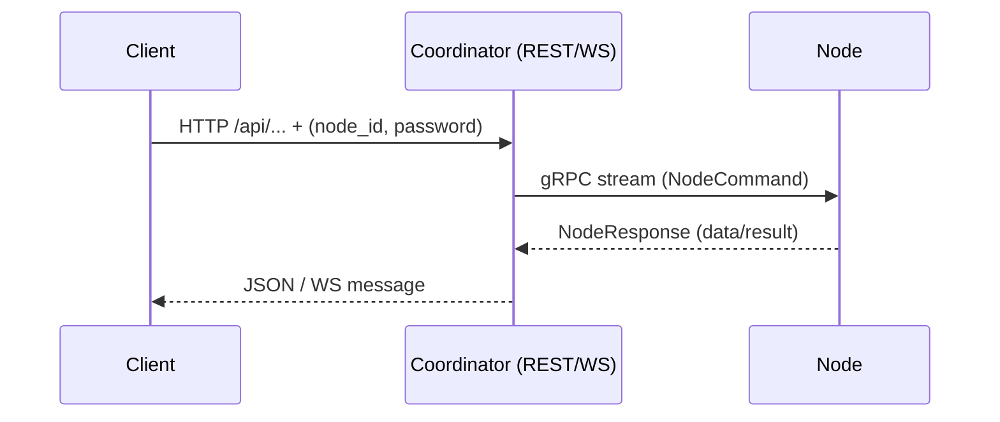

## Docklord

**Docklord** is a lightweight, high-performance container management and monitoring tool written in Rust. Designed for distributed environments, it provides real-time insights and seamless control over your Docker containers.

## 🧠 How it works

- **Node**: a lightweight agent you run on your own machine (server/PC/VPS). It opens an outbound gRPC stream to the Coordinator and talks to Docker via `docker.sock`. No inbound ports are required on the node.
- **Coordinator**: a public-facing service exposing **REST API** and **WebSocket**. It authenticates nodes and forwards commands to the correct node using your `node_id` and `password`.
- **Clients**: call the Coordinator with `node_id` and `password`; results and events stream back via HTTP responses or WebSocket.



## ✨ Highlights

- Instant monitoring over WebSocket
- Zero inbound ports on the node (outbound gRPC only)
- Lightweight images (~13 MB)
- Public coordinator or full self-hosting

---

## 🚀 Quick Start

Choose one of the following options to get started:

### 1. Connect to Public Coordinator (Fastest)

```bash
COORDINATOR_ADDR=http://82.27.2.230:50051 \
  docker-compose up docklord-node
```

Then test from any device:

```bash
curl "http://82.27.2.230:3000/api/containers?node_id=YOUR_NODE_ID&password=YOUR_PASSWORD"
```

```javascript
const ws = new WebSocket(
  "ws://82.27.2.230:3000/ws?node_id=YOUR_NODE_ID&password=YOUR_PASSWORD"
);
ws.onmessage = (e) => console.log(JSON.parse(e.data));
```

### 2. Self-Hosted All-in-One

```bash
git clone https://github.com/DaDaDaTheoryNow/docklord.git
cd docklord
docker-compose up docklord-self-hosted
```

### 3. Separate Coordinator + Node

```bash
# Start the coordinator:
docker-compose up docklord-coordinator

# In a new terminal, start the node:
docker-compose up docklord-node
```

### 4. Build and Run from Source

```bash
cargo run --release -- --type self-hosted
```

---

## 🔐 Security

- Keep `node_id` and `password` secret; treat them like API keys.
- Prefer your own Coordinator behind HTTPS (reverse proxy) in production.
- The node requires only outbound access to the Coordinator (gRPC), no inbound ports.

---

## ⚙️ Environment Variables

| Variable           | Default                             | Description                   |
| ------------------ | ----------------------------------- | ----------------------------- |
| `API_PORT`         | `3000`                              | Port for REST API & WebSocket |
| `GRPC_PORT`        | `50051`                             | Port for gRPC communications  |
| `COORDINATOR_ADDR` | `http://host.docker.internal:50051` | Coordinator URL for nodes     |
| `RUST_LOG`         | `info`                              | Logging level                 |

**Examples:**

```bash
# Public server:
COORDINATOR_ADDR=http://82.27.2.230:50051 \
  docker-compose up docklord-node

# Custom ports:
API_PORT=8080 GRPC_PORT=50052 \
  docker-compose up docklord-self-hosted

# Using a .env file:
echo "COORDINATOR_ADDR=http://82.27.2.230:50051" > .env
docker-compose up docklord-node
```

---

## 📁 Project Layout

```
docklord/
├── crates/
│   ├── bin/docklord-runner/     # Main executable
│   ├── coordinator/             # Coordinator service
│   ├── node/                    # Node service
│   └── proto/                   # Protobuf definitions
├── docker-compose.yml           # Deployment configurations
├── Dockerfile                   # Multi-stage build
└── README.md                    # This file
```

---

## 🚢 Production Deployment

1. **Clone to `/opt/apps`** (or your preferred directory):

   ```bash
   sudo mkdir -p /opt/apps && cd /opt/apps
   sudo git clone https://github.com/DaDaDaTheoryNow/docklord.git
   cd docklord
   sudo chown -R $USER:$USER .
   ```

2. **Set up `.env` and run**:

   ```bash
   cp env.example .env
   # Edit .env as needed
   docker-compose up -d
   ```

3. **Enable Docker on boot** (Systemd example):

   ```bash
   sudo systemctl enable docker
   sudo systemctl start docker
   ```

---

## 🆘 Troubleshooting

### Node Fails to Connect

```bash
docker-compose ps
docker-compose logs docklord-coordinator
```

### Port Conflicts

```bash
API_PORT=8080 GRPC_PORT=50052 \
  docker-compose up docklord-self-hosted
```

### Docker Socket Permissions

```bash
sudo chmod 666 /var/run/docker.sock
```

---

## 📄 License

MIT © [DaDaDaTheoryNow](https://github.com/DaDaDaTheoryNow)

---

## ⚡️ API Overview

### API Endpoints

| Method | Endpoint                     | Description                        | Query Parameters                                 |
| ------ | ---------------------------- | ---------------------------------- | ------------------------------------------------ |
| GET    | `/api/containers`            | List all containers                | `node_id`, `password`                            |
| GET    | `/api/containers/:id/status` | Get detailed status of a container | `node_id`, `password`                            |
| POST   | `/api/containers/:id/start`  | Start a container                  | `node_id`, `password`                            |
| POST   | `/api/containers/:id/stop`   | Stop a container                   | `node_id`, `password`                            |
| DELETE | `/api/containers/:id`        | Delete a container                 | `node_id`, `password`                            |
| GET    | `/api/containers/:id/logs`   | Get container logs (with options)  | `node_id`, `password`, `tail`, `since`, `follow` |

> **Note:**  
> All API requests require `node_id` and `password` as query parameters for authentication.  
> Example: `/api/containers?node_id=...&password=...`

---

#### Example Requests

- **List containers:**

  ```
  GET /api/containers?node_id=1&password=123
  ```

- **Get container status:**

  ```
  GET /api/containers/abc123/status?node_id=1&password=123
  ```

- **Start a container:**

  ```
  POST /api/containers/abc123/start?node_id=1&password=123
  ```

- **Stop a container:**

  ```
  POST /api/containers/abc123/stop?node_id=1&password=123
  ```

- **Delete a container:**

  ```
  DELETE /api/containers/abc123?node_id=1&password=123
  ```

- **Get container logs:**
  ```
  GET /api/containers/abc123/logs?node_id=1&password=123&tail=100&since=...&follow=false
  ```

---

All requests must include `node_id` and `password` as query parameters.

---
