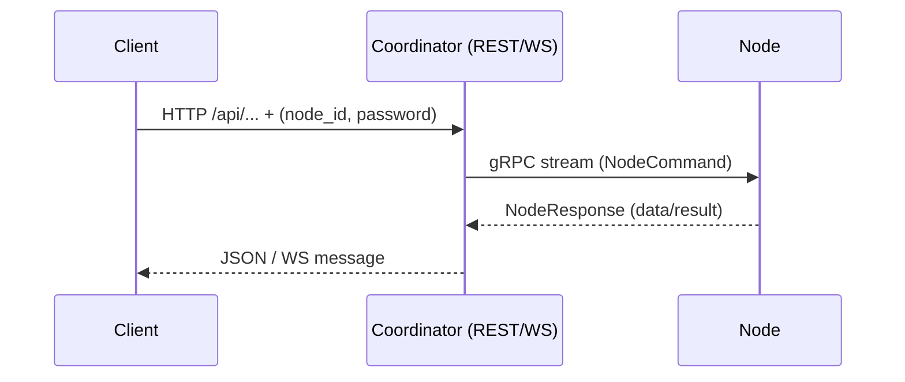

# Docklord — Quick Start (Slim)

**Docklord** is a lightweight, high-performance Docker container management and monitoring tool written in Rust. It acts as a **proxy-like orchestration bridge** between clients and Docker hosts:

- **Clients** send requests to the **Coordinator** via REST API or WebSocket.
- The **Coordinator** converts those requests into gRPC commands and sends them to the appropriate **Node** over a persistent, outbound gRPC stream (port `50051`).
- The **Node** executes the requested Docker actions (start/stop/list/show containers, fetch logs, etc.) using `/var/run/docker.sock`.
- Results are sent back from the Node to the Coordinator via gRPC and returned to the client via REST/WS.

No inbound ports are required on Nodes — ideal for secure, remote container management.



---

## Architecture Overview

- **Node** — lightweight agent running on your server/PC/VPS; connects out to the Coordinator; interacts directly with Docker.
- **Coordinator** — central service (public or self-hosted) that exposes REST and WebSocket APIs for clients, handles authentication, and dispatches gRPC commands to Nodes.
- **Clients** — any app, CLI, or integration that talks to the Coordinator’s REST/WS endpoints using `node_id` and `password`.

---

## Quick Start

### Option A — Pre-built Binary

1. Download the latest release from GitHub.
2. Make it executable:

```bash
chmod +x docklord
```

3. Examples:

```bash
# All-in-one (Coordinator + Node)
./docklord --type self-hosted

# Node only (connect to remote Coordinator)
./docklord --type node --coordinator-addr http://82.27.2.230:50051
```

4. Test API:  
   When you run a Node, Docklord automatically displays an example `curl` command in the console so you can test it right away. You can also use these examples:

```bash
# Self-hosted locally
curl -s "http://localhost:3000/api/containers?node_id=YOUR_NODE_ID&password=YOUR_PASSWORD" | jq '.'

# Node connected to public Coordinator
curl -s "http://82.27.2.230:3000/api/containers?node_id=YOUR_NODE_ID&password=YOUR_PASSWORD" | jq '.'
```

### Option B — Docker (Production Recommended)

#### Connect to Public Coordinator

```bash
COORDINATOR_ADDR=http://82.27.2.230:50051 \
  docker-compose up docklord-node
```

#### Self-hosted (All-in-one)

```bash
git clone https://github.com/DaDaDaTheoryNow/docklord.git
cd docklord
docker-compose up docklord-self-hosted
```

#### Coordinator + Node Separately

```bash
# Coordinator
docker-compose up docklord-coordinator

# Node
COORDINATOR_ADDR=http://localhost:50051 docker-compose up docklord-node
```

---

## Configuration

**CLI Flags**

- `--type` — `self-hosted` | `coordinator` | `node`
- `--coordinator-addr` — Coordinator address (for `node`)
- `--api-port` — REST API port (default `3000`)
- `--grpc-port` — gRPC port (default `50051`)
- `--node-id`, `--password` — Node credentials

**Environment Variables**

- `COORDINATOR_ADDR` — Coordinator address
- `DOCKLORD_NODE_ID` — Node ID
- `DOCKLORD_PASSWORD` — Node password
- `API_PORT` / `DOCKLORD_API_PORT` — API port
- `GRPC_PORT` / `DOCKLORD_GRPC_PORT` — gRPC port
- `RUST_LOG` — log level
